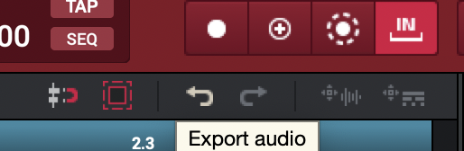

# Workflow ideas
- MPC + squarp
  - midi from MPC -> squarp -> squarp effects -> DAW
# How to?
- How to setup choke groups?
- How to save kit?
- Where is this saved?
- How to sample sections of tracks into pads (resampling)
  - press `track select` to toggle to `midi track`
  - go to track containing pattern
  - click on export audio

   - go to empty bank on drum pads
   - drag to pad

# To do
- Chord mode -> strummed -> Spitfire Strings -> Expression mapped to touch pad.

---

# Tutorials

## [MPC Studio Master class](youtube.com/watch?v=TTx7yxS_le4&t=1656s)
### Basics
1. Start with empty sequence: `shft track-select`, turn knob to right
2. Rename it "master class" w/ computer
3. set bar lenght to 4: *how to do on controller?*
4. Change tempo: hold down `tempo` and rotate knob
5. Press `track select` to select empty track
6. Go to track one
7. Tell it track type: hold `shift` and `program select` and rotate knob to tell track type
8. Press `track select` and rename the track in software.  Notice the LCD screen to updated track name
9. Press `program select` to browse through different drum kits (already loaded)
10. To load more kits, press `Browse` and rotate knob to hear all the different kits in expansion pack
11. Save work: `mode` + `pad 16`.

### Building beat from scratch (start at -52:34)

1. `Track select` to select track one
2. `TC On` for quantize on
3. `Record` + `play` + lay down kick and snare

### 4. Adding 808 and synthbass (-42:21)

### 5. Adding more drum parts (-36:53)

### 6. Adding melodies with lugins (-33:00)

### 7. Chopping vocal samples (-32:00)

### 8. Arranging beat into song (-25:36)
- track mute mode to toggle mute tracks in real time

1. Double length of sequence: edit -> sequence -> double length, do again to make 16 bars, repeat till 64 bars
2. see all tracks: `shift` + `pad mute`
3. Now you can hit pads corresponding to tracks to mute/unmute them

### 9. Mixing (-20:32)

### 10. Low-fi fx touch strip (-11:32)

---

## [Beginners workflow guide](https://www.youtube.com/watch?v=sAp0gYA6KOU&t=660s)
### Browsing samples
1. Enable entire disk access for MPC so it can see external drive (didn't work, fix this)
   - *How to load samples to pads?*
2. Toggle `Browse` between files and expansion packs
   - *How to load?*

This guy sucks do the bottom instead

## [Build drum kits](https://www.youtube.com/watch?v=GoW979UpYNE)
- close the quick help pannel: `H`
- stop anything playing: `double press "stop"`

1. select a pad
2. go to browser (either expansion or file browser)
3. browse samples and preview
4. press on datawheel to load
5. `cmd z` to undo if sucks
6. tune samples by selecting pad, press `tune`
7. Layer samples by pressing `Sample select`
8. Make a quick beat with these new samples: press `record` then `play`
